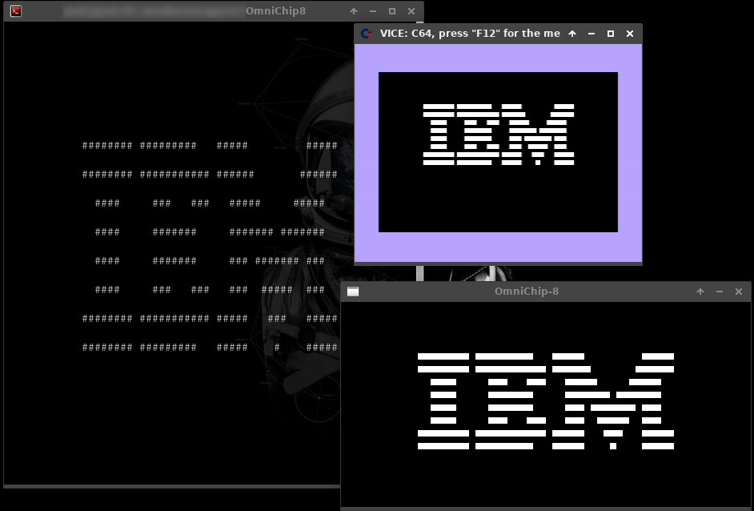

OmniChip-8
=======
A Chip-8 emulator with heavy emphasis on being as cross-platform as humanly possible

Supported platforms
------ 
### Partial
 * Desktop SDL
 * (n)curses
 * Commodore 64
 * GameBoy

### Planned
 * Apple ][
 * NES
 * MS-DOS/FreeDOS/DR-DOS
 * TI-8x
 * ?

## Screenshot
