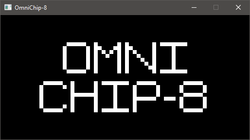
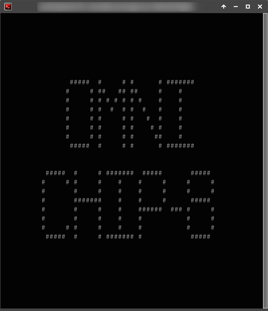
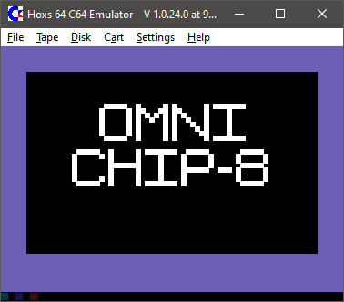
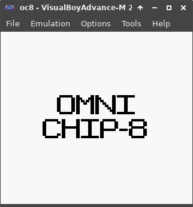

OmniChip-8
=======
A Chip-8 emulator with heavy emphasis on being as cross-platform as humanly possible

Building instructions
-----
## Desktop (SDL)
Run `python make.py`. In Windows, it is able to use Visual Studio (via the msbuild command) or mingw.
### Visual Studio/msbuild
If you are using Visual Studio/msbuild, you need to get the SDL headers and library. Install the headers to `lib/sdl2/include`. Install the static .lib files and the dll file to `lib/sdl2/lib/x64`. You can just download the development library [here](http://libsdl.org/download-2.0.php) and drop the `include` and `lib` subdirectories into `lib/sdl2/`
### mingw
If you are using mingw, you need to run `pacman -S base-devel mingw-w64-x86_64-gcc mingw-w64-x86_64-SDL2` before using make.py.

## Desktop (curses, UNIX-like OSs)
Run `python make.py build --library curses`
## Commodore 64
Run `python make.py build --platform c64`
## GameBoy
Run `python make.py build --platform gb`

Supported platforms
------ 
## Mostly done
 * Desktop SDL

 * (n)curses

 * Commodore 64

 * GameBoy

## Planned
 * WebAssembly + SDL
 * TI-8x
 * Apple ][
 * NES
 * Sphere, via WebAssembly/Emscripten
 * MS-DOS/FreeDOS/DR-DOS

## Maybe/hopefully
 * Magic-1
 * Bare metal x86
